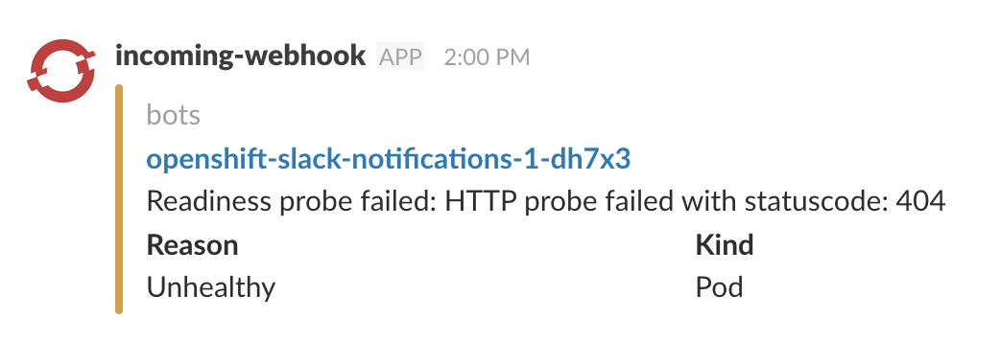

# OpenShift Slack Notifications

A project to send OpenShift error messages to a slack channel of your choice.

## Cluster Deployment

First create a [Slack Incoming Webhook](https://my.slack.com/services/new/incoming-webhook).

Then deploy this bot to OpenShift with permissions via:

```shell
$ oc adm policy add-cluster-role-to-user cluster-reader system:serviceaccount:<current-project-here>:default --as=system:admin
$ oc new-app -f https://raw.githubusercontent.com/OutThereLabs/openshift-slack-notifications/master/template.yaml \
             -p SLACK_WEBHOOK_URL=https://hooks.slack.com/services/<webhook-specifics-here> \
             -p OPENSHIFT_CONSOLE_URL=https://<openshift-host-here>:8443/console
$ oc start-build openshift-slack-notifications
```

Once the app is built and deployed, it will start sending notifications to slack when there are `Warning` type events.



## Local Development

### Cluster Requirements

First you need a running minishift cluster. This can be installed via homebrew:

```shell
$ brew install socat openshift-cli docker-machine-driver-xhyve
$ brew tap caskroom/versions
$ brew cask install minishift-beta
```

The xhyve hypervisor requires superuser privileges. To enable, execute:

```shell
$ sudo chown root:wheel /usr/local/opt/docker-machine-driver-xhyve/bin/docker-machine-driver-xhyve
$ sudo chmod u+s /usr/local/opt/docker-machine-driver-xhyve/bin/docker-machine-driver-xhyve
```

Then start the cluster with:

```shell
$ minishift start --memory 4048
```

### App Requirements

First add the privileges to mount volumes and read cluster state to your service account:

```shell
$ oc login -u system:admin
$ oc adm policy add-scc-to-user hostmount-anyuid system:serviceaccount:myproject:default --as=system:admin
$ oc adm policy add-cluster-role-to-user cluster-reader system:serviceaccount:myproject:default --as=system:admin
```

Then create your dev environment via the provided template

```shell
$ oc process -f debug-template.yaml -v SOURCE_PATH="${PWD}" SLACK_WEBHOOK_URL=<slack-webhook-url-here> OPENSHIFT_CONSOLE_URL=https://<cluster-ip-here>:8443/console | oc create -f -
$ oc start-build go
```

### Debugging the app

To run a local copy, start a debug pod

```shell
$ oc debug dc/go-dev
$ cd go/github.com/outtherelabs/openshift-slack-notifications && glide up
$ go run main.go
```
